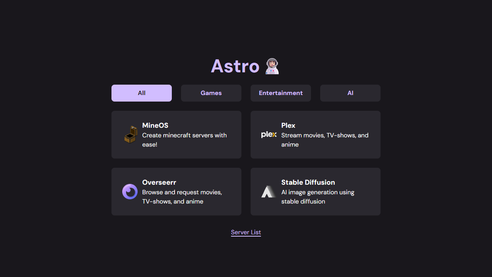

# Astro Dashboard

## Introduction

This is a dashboard created for my NAS. It is a simple NextJs project built with Typescript, Tailwind and framer-motion.

It can be hosted as a serverless website, and the most simple method is to open a terminal and run the serve command after installing dependencies.

## Requirements

This project requires NodeJs. Get it [here](https://nodejs.org/en/download/).

I highly recommend installing [Yarn](https://yarnpkg.com/getting-started/install) (an alternate package manager to npm).

## Getting Started

### Using Docker Image

First we need to clone the project. This project includes a dockerimage, which can be built and ran to serve the web-server.

To clone the project, use this command:

```git
git clone https://github.com/SivertGullbergHansen/sivert-unraid-dashboard.git dashboard
cd dashboard
```

Next build the docker image:

```docker
docker build -t dashboard .
```

And to start a container:

```docker
docker run -d -p 80:80 dashboard
```

#### 1. Install dependencies

npm

```bash
npm i
```

Yarn

```bash
yarn
```

#### 2. Build and serve project

npm

```bash
npm run serve
```

Yarn

```bash
yarn serve
```

## Further development

To further develop this project, start the website in development mode, to enable hot-reloading:

npm

```bash
npm run dev
```

Yarn

```bash
yarn dev
```
